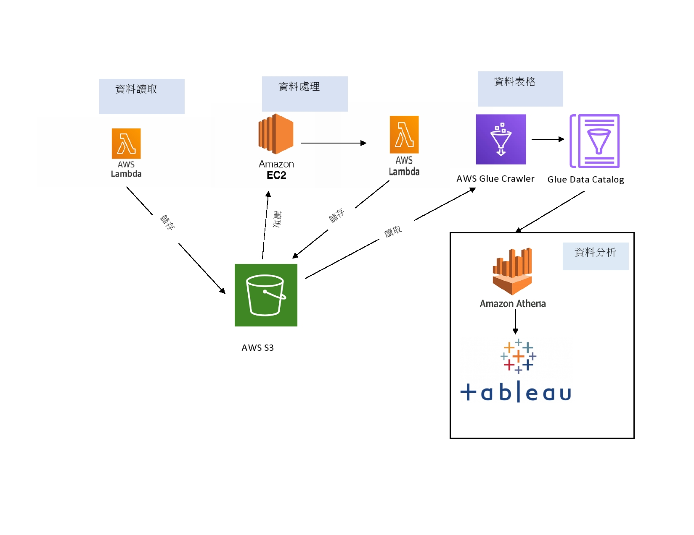
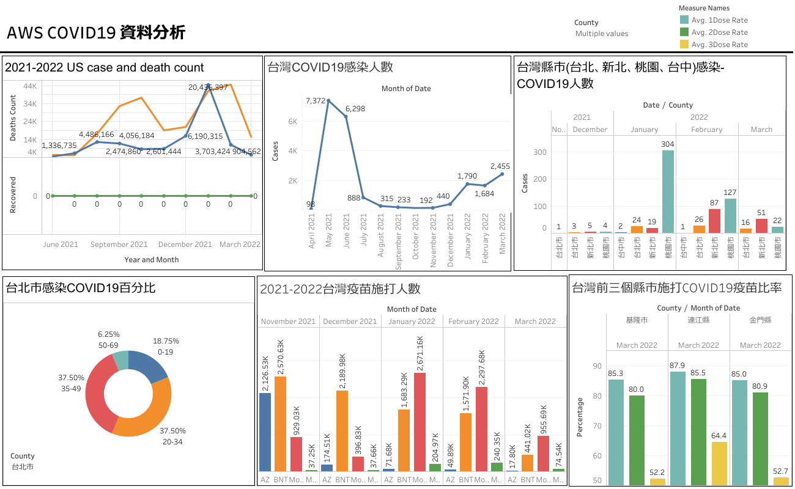

#AWS COVID19 資料整合
##介紹
這個COVID19專案是由多個資料整合包括美國COVID19感染人數、復原人數、台灣COVID19資料和台灣各縣市COVID19疫苗施打人數，
AWS COVID19資料整合使用New York Times、疫情指揮中心和衛福部疾管署的數據，將資料彙集後，在Amazon AWS把資料匯入、資料處理和建立資料庫，
這個專案使用AWS s3、Lambda、Glue、Athena等，並且使用PowerBI 軟體(Tableau)做資料分析，產出圖表後，將圖表放入Dashboard，這個專案是參考
[Cloud Guru Challenge](https://acloudguru.com/blog/engineering/cloudguruchallenge-python-aws-etl).

##目標
使用Amazon AWS雲端服務和線上處理COVID19的資料，我使用Python做資料處理，整合COVID19和疫苗資料後，在AWS Glue產生Catalog Table，
並將資料匯入和儲存在AWS s3，並且專案會產出COVID19的資料分析，做出一個COVID19分析的Dashboard。

##資料來源
1. US COVID19 Cases and Death：https://raw.githubusercontent.com/nytimes/covid-19-data/master/us-counties.csv
2. US COVID19 Recover: https://raw.githubusercontent.com/datasets/covid-19/master/data/time-series-19-covid-combined.csv
3. 台灣COVID19 病例數：https://od.cdc.gov.tw/eic/Day_Confirmation_Age_County_Gender_19CoV.csv
4. 疫苗接種人數：https://www.aweb.tpin.idv.tw/COVID-19/vaccine.php?pageNum_vaccineList=1
5. 台灣各縣市疫苗接種率：https://covid-19.nchc.org.tw/dt_002-csse_covid_19_daily_reports_vaccine_city2.php

##專案架構

在AWS Lambda用Python request讀取api資料，原始資料儲存在AWS S3，再使用AWS EC2和Lambda處理資料，將處理的資料儲存在S3。接著，使用AWS Glue把
AWS s3資料轉成資料表格(Glue Data Catalog)，可以用AWS Athena搜尋資料，並且用Tableau產生資料圖表。
##ETL Jobs (資料抽取、轉換、裝載)
COVID19資料整合專案搜集各個資料來源，在AWS Lambda做資料抽取、轉換和裝載，將不同檔案格式(Excel、CSV)做資料處理和統整後，再把資料匯入到資料庫和AWS S3
###資料提取
從各個資料來源，我用Python讀取網站的資料，將原始資料存入AWS S3，關於US COVID19資料是由2020~2022年的COVID19 案例數和死亡人數，
台灣COVID19資料涵蓋2020~2022有縣市、鄉鎮、境外移入、年齡層和病例數等欄位，台灣疫苗資料包括莫德納、AZ、BNT和高端施打人數，還有台灣COVID19各縣市
疫苗施打率

###資料轉換
我使用AWS EC2和Lambda做資料處理，在Lambda用Python處理US COVID19、台灣COVID19 Cases和台灣疫苗資料，我將資料新增索引欄位和增加年齡群欄位，
台灣疫苗資料是Excel表格包括2021/05~2022/03，將日期資料修改字串，並把日期對應到每一個欄位，我還將US Cases、台灣COVID19案例數和台灣疫苗施打人數
資料更新，US Cases和台灣COVID19案例數資料隔一天更新，台灣疫苗施打率資料是隔一週更新。

###資料輸入
將各個資料（US Cases、台灣COVID19案例數和台灣疫苗施打率）處理後，把資料存入AWS S3，再由Glue 編目程式創建資料表格Glue Data Catalog

##資料分析
我使用AWS Athena搜尋資料，並且用PowerBI軟體(Tableau)做資料分析，分析的圖表是依據以下的問題產出，再把圖表放入Dashboard
1. 從2021-2022年US Cases, Death, and Recovery人數
2. 從2021-2022台灣COVID19感染人數
3. 台灣各縣市（台北、新北、桃園和台中）和各年齡層感染COVID19人數
4. 台北市各年齡層感染COVID19百分比
5. 2021-2022年台灣疫苗施打人數
6. 台灣前三個縣市施打COVID19疫苗比率

##Reference
1. CloudGuruChallenge
https://acloudguru.com/blog/engineering/cloudguruchallenge-python-aws-etl
2. Movalytics --Github
https://github.com/alanchn31/Movalytics-Data-Warehouse
3. How do I allow my Lambda execution role to access my Amazon S3 bucket?
https://aws.amazon.com/premiumsupport/knowledge-center/lambda-execution-role-s3-bucket/